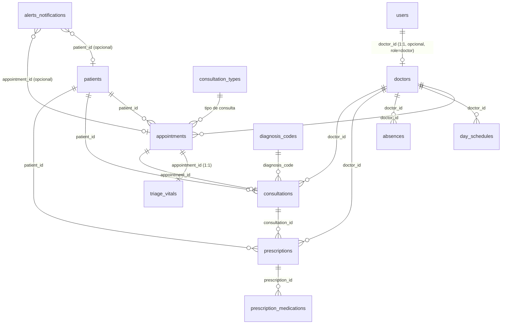

# Estructura de Base de Datos Propuesta — MedControl Clinical Suite

> Documento generado a partir del código actual (Angular 22, estado 100% mock en memoria).
> El modelo refleja las entidades reales de `src/app/core/models/types.ts`, `MockDataService`
> y los shapes inline de cada vista. El target de BD es **PostgreSQL**.

---

## 1. Panorama y decisiones

- La aplicación hoy no tiene backend: toda la "base de datos" vive en `MockDataService`
  (estado en signals) y en arrays hardcodeados en los componentes.
- Este documento define el **modelo relacional objetivo (PostgreSQL)** para migrar el mock a una BD real.
- `AppointmentStatus` (9 estados) describe el viaje completo de una cita:
  `pending → confirmed → checked-in → in-triage → triaged → in-progress → completed` (+ `break` / `no-show`).
- Identificadores: pacientes usan expediente `MED-XXXX`; doctores `doc-*`; usuarios `usr-*`;
  citas `apt-*`; consultas `CONS-*`; recetas `RX-*`.

---

## 2. Diagrama de relaciones

---

## 3. Tablas detalladas

### 3.1 `users`

Origen: `User` (types.ts:12) + `MockUser` (auth.service.ts:5).

| Columna | Tipo | Restricciones | Descripción |
|---|---|---|---|
| id | UUID / TEXT | PK | `usr-001` ... |
| name | VARCHAR(120) | NOT NULL | Nombre del usuario |
| email | VARCHAR(255) | UNIQUE, NOT NULL | Login |
| password_hash | VARCHAR(255) | NOT NULL | Hash (en mock: texto plano) |
| role | ENUM(`admin`,`doctor`) | NOT NULL | `UserRole` |
| doctor_id | TEXT | FK → doctors.id, NULL | Solo si `role='doctor'` (1:1) |
| avatar_url | VARCHAR(500) | NULL | Foto/avatar |

Notas:
- 1 fila por usuario; un médico puede (no necesariamente) tener una cuenta.
- Credenciales mock: `admin@medcontrol.com/admin123`; `*@medcontrol.com/doctor123`.

---

### 3.2 `doctors`

Origen: `Doctor` (types.ts:37) + `DoctorSummary` (mock-data.service.ts:13).
> **Gap detectado**: el código tiene DOS representaciones de doctor; BD debe unificar.

| Columna | Tipo | Restricciones | Descripción |
|---|---|---|---|
| id | TEXT | PK | `doc-aguirre`, `doc-mawad`, `doc-munoz` |
| name | VARCHAR(120) | NOT NULL | `Dra. Noemí Aguirre` |
| short_name | VARCHAR(60) | NULL | `Dra. Aguirre` |
| specialty | VARCHAR(120) | NOT NULL | `Medicina General` |
| active_today | BOOLEAN | DEFAULT true | Disponible hoy |
| avatar_url | VARCHAR(500) | NULL | Foto del médico |

---

### 3.3 `patients`

Origen: `Patient` (types.ts:21).

| Columna | Tipo | Restricciones | Descripción |
|---|---|---|---|
| id | TEXT | PK | Expediente `MED-0001` ... (auto `MED-XXXX`) |
| ci | VARCHAR(30) | UNIQUE, NOT NULL | Documento (`V-12.345.678`) |
| name | VARCHAR(200) | NOT NULL | |
| birth_date | DATE | NULL | En mock `dd/MM/yyyy` |
| age | SMALLINT | NULL | Puede derivarse de birth_date |
| phone | VARCHAR(30) | NULL | `+58 412-...` |
| email | VARCHAR(255) | NULL | |
| address | VARCHAR(300) | NULL | |
| insurance | VARCHAR(120) | NULL | `Seguros Caracas`, `Plan Madisons` |
| blood_type | VARCHAR(5) | NULL | `O+`, `A+` |
| allergies | TEXT[] | DEFAULT '{}' | `['Penicilina']` |
| chronic_conditions | TEXT[] | DEFAULT '{}' | `['Hipertensión Arterial']` |
| consent_signed | BOOLEAN | DEFAULT false | Consentimiento informado |

Nota de dominio: el modal de alta (patient-history) usa campo `rut` con formato chileno mientras los
registros usan `ci` venezolano — incoherencia a resolver (ver §6).

---

### 3.4 `appointments`

Origen: `AppointmentItem` (types.ts:45) + `AppointmentStatus` (types.ts:43).

| Columna | Tipo | Restricciones | Descripción |
|---|---|---|---|
| id | TEXT | PK | `apt-1` ... `apt-past-2` |
| date | DATE | NOT NULL | `YYYY-MM-DD` |
| time | TIME | NOT NULL | `08:30 AM` |
| duration_minutes | SMALLINT | NOT NULL | 30–45 |
| patient_id | TEXT | FK → patients.id, NULL | Puede ser NULL en bloques `break` |
| doctor_id | TEXT | FK → doctors.id, NULL | Puede ser NULL en bloques `break` |
| reason | TEXT | NOT NULL | Motivo de la cita |
| status | ENUM(9) | NOT NULL | pending/confirmed/checked-in/in-triage/triaged/in-progress/completed/break/no-show |
| consultation_type_id | TEXT | FK → consultation_types.id, NULL | Tipo de consulta (propuesto) |
| relative_time | VARCHAR(50) | NULL | `relativeTime?` no poblado en mock |
| created_at | TIMESTAMPTZ | DEFAULT now() | Propuesto |

Flujo de estados:
`pending → confirmed → checked-in → in-triage → triaged → in-progress → completed`; ramas `break`, `no-show`.

---

### 3.5 `triage_vitals`

Origen: `TriageVitalsSnapshot` (types.ts:58) + `TriageVitals` (types.ts:119), llenado por `completeTriage()` (mock-data.service.ts:256).

| Columna | Tipo | Restricciones | Descripción |
|---|---|---|---|
| id | BIGSERIAL | PK | |
| appointment_id | TEXT | FK → appointments.id, UNIQUE | Un snapshot vital por cita triageada |
| systolic | SMALLINT | NOT NULL | mmHg |
| diastolic | SMALLINT | NOT NULL | mmHg |
| pulse | SMALLINT | NOT NULL | bpm |
| temperature | NUMERIC(4,1) | NOT NULL | °C |
| spo2 | SMALLINT | NOT NULL | % |
| weight | NUMERIC(5,1) | NULL | kg |
| height | SMALLINT | NULL | cm |
| notes | TEXT | NULL | Observaciones de enfermería |
| taken_at | TIMESTAMPTZ | DEFAULT now() | Propuesto |

Los vitals también se guardan embebidos en `appointments.vitals` (snapshot compacto); BD los
normaliza en esta tabla y el snapshot es representación.

---

### 3.6 `consultations`

Origen: `Consultation` (types.ts:130).
> **Gap detectado**: hoy NO tiene `appointment_id` ni `doctor_id` (doctor se guarda solo como nombre).

| Columna | Tipo | Restricciones | Descripción |
|---|---|---|---|
| id | TEXT | PK | `CONS-<timestamp>` |
| patient_id | TEXT | FK → patients.id, NOT NULL | |
| appointment_id | TEXT | FK → appointments.id, NULL | **Propuesto** (origen de la atención) |
| doctor_id | TEXT | FK → doctors.id, NULL | **Propuesto** (hoy es `doctorName` denormalizado) |
| date | DATE | NOT NULL | `toLocaleDateString('es-CL')` |
| time | TIME | NOT NULL | `toLocaleTimeString('es-CL')` |
| type | VARCHAR(60) | NOT NULL | `Control` (hardcodeado hoy) |
| chief_complaint | TEXT | NULL | Motivo de consulta |
| history_of_present_illness | TEXT | NULL | Enfermedad actual |
| physical_exam | TEXT | NULL | |
| vitals | JSONB | NULL | Snapshot `VitalSigns` (types.ts:109) |
| diagnosis_code | VARCHAR(10) | FK → diagnosis_codes.code, NULL | CIE-10 |
| diagnosis_description | TEXT | NULL | |
| treatment_plan | TEXT | NULL | Plan de tratamiento |
| notes | TEXT | NULL | |
| status | ENUM(`draft`,`completed`) | NOT NULL | Solo se persiste `completed` vía `addConsultation()` |

---

### 3.7 `prescriptions`

Origen: shape inline `prescriptions` en recetas.component.ts (sin interfaz formal).

| Columna | Tipo | Restricciones | Descripción |
|---|---|---|---|
| id | TEXT | PK | `RX-99412` |
| patient_id | TEXT | FK → patients.id, NOT NULL | **Propuesto** (hoy `patient` es solo nombre) |
| doctor_id | TEXT | FK → doctors.id, NOT NULL | **Propuesto** (hoy `doctor` es solo nombre) |
| consultation_id | TEXT | FK → consultations.id, NULL | **Propuesto** |
| ci | VARCHAR(30) | NULL | Documento del paciente |
| date | DATE | NOT NULL | `14 Oct 2024` |
| status | ENUM(`Vigente en Farmacia`,`Emitida Hoy`,`Finalizada`) | NOT NULL | |

### 3.8 `prescription_medications`

Origen: `prescriptions.meds: string[]` (recetas.component.ts).

| Columna | Tipo | Restricciones | Descripción |
|---|---|---|---|
| id | BIGSERIAL | PK | |
| prescription_id | TEXT | FK → prescriptions.id, NOT NULL | |
| name | VARCHAR(200) | NOT NULL | Medicamento |
| dose | VARCHAR(120) | NULL | Presentación/dosis |
| frequency | TEXT | NULL | Indicación (propuesto) |

---

### 3.9 `working_days`

Origen: `WorkingDay` (types.ts:72). Define el set de fechas hábiles (fuente única de `isBusinessDay()`).

| Columna | Tipo | Restricciones | Descripción |
|---|---|---|---|
| date | DATE | PK | `YYYY-MM-DD` |
| note | VARCHAR(120) | NULL | `Turno normal` |

---

### 3.10 `day_schedules`

Origen: `DaySchedule` (types.ts:77).
> **Gap detectado**: hoy es una única jornada global para todo el equipo; BD propone por doctor.

| Columna | Tipo | Restricciones | Descripción |
|---|---|---|---|
| id | BIGSERIAL | PK | |
| doctor_id | TEXT | FK → doctors.id, NULL, UNIQUE(doctor_id, day_of_week) | NULL = jornada global |
| day_of_week | SMALLINT | NOT NULL | 1=Lun ... 6=Sáb (sin domingo en mock) |
| enabled | BOOLEAN | DEFAULT true | |
| start_time | TIME | NULL | `08:00` |
| end_time | TIME | NULL | `16:00` |
| total_capacity | SMALLINT | NULL | 20 pacientes/día |

---

### 3.11 `absences`

Origen: `AbsenceBlock` (types.ts:85).
> **Gap detectado**: `period` es texto libre; sin FK a doctor. BD propone fechas estructuradas.

| Columna | Tipo | Restricciones | Descripción |
|---|---|---|---|
| id | TEXT | PK | `abs-1` |
| doctor_id | TEXT | FK → doctors.id, NULL | **Propuesto** |
| reason | VARCHAR(200) | NOT NULL | `Congreso Médico Venezolano 2026` |
| location | VARCHAR(200) | NULL | |
| type | VARCHAR(120) | NOT NULL | `Actividad Académica` |
| start_date | DATE | NOT NULL | **Propuesto** (hoy dentro de `period`) |
| end_date | DATE | NOT NULL | **Propuesto** |
| affected_note | VARCHAR(200) | NULL | `0 citas colisionadas` |
| collision_status | VARCHAR(30) | NULL | `ok` |
| validation_status | VARCHAR(60) | NULL | `Aprobado por Dirección Médica` |
| icon_name | VARCHAR(60) | NULL | `school` |

---

### 3.12 `alerts_notifications`

Origen: shape inline `alerts` en alertas.component.ts (sin interfaz formal).

| Columna | Tipo | Restricciones | Descripción |
|---|---|---|---|
| id | TEXT | PK | `al-1` |
| title | VARCHAR(200) | NOT NULL | |
| description | TEXT | NULL | |
| time | VARCHAR(60) | NOT NULL | `Hace 5 min` |
| level | ENUM(`critical`,`info`,`success`) | NOT NULL | |
| icon | VARCHAR(60) | NULL | nombre de glifo |
| action | VARCHAR(120) | NULL | texto de la acción |
| route | VARCHAR(60) | NULL | `NavRoute` destino |
| patient_id | TEXT | FK → patients.id, NULL | **Propuesto** |
| appointment_id | TEXT | FK → appointments.id, NULL | **Propuesto** |
| is_read | BOOLEAN | DEFAULT false | Estado leído (hoy solo toast) |

---

### 3.13 Catálogo `consultation_types`

Origen: shape `consultationTypes` en appointment-booking.component.ts.

| Columna | Tipo | Restricciones | Descripción |
|---|---|---|---|
| id | ENUM(`primera`,`control`,`sobrecupo`,`examenes`) | PK | |
| title | VARCHAR(120) | NOT NULL | |
| duration_minutes | SMALLINT | NOT NULL | `45` |
| price | VARCHAR(80) | NOT NULL | `$75.000 Particular` |
| note | TEXT | NULL | |
| suggested | BOOLEAN | DEFAULT false | |

### 3.14 Catálogo `diagnosis_codes`

Origen: shape `commonDiagnoses` en consulta.component.ts (CIE-10).

| Columna | Tipo | Restricciones | Descripción |
|---|---|---|---|
| code | VARCHAR(10) | PK | `I10` |
| label | TEXT | NOT NULL | Descripción del diagnóstico |

---

## 4. Enumeraciones

| Enum | Valores |
|---|---|
| `AppointmentStatus` | `pending`, `confirmed`, `checked-in`, `in-triage`, `triaged`, `in-progress`, `completed`, `break`, `no-show` |
| `UserRole` | `admin`, `doctor` |
| `NavRoute` | `dashboard-de-citas`, `pacientes-y-historial-clinico`, `agenda-y-disponibilidad`, `recetas-y-examenes`, `notificaciones-y-alertas`, `configuracion-del-sistema`, `login` |
| `alert level` | `critical`, `info`, `success` |
| `consultation type` | `primera`, `control`, `sobrecupo`, `examenes` |
| `consultation status` | `draft`, `completed` |
| `prescription status` | `Vigente en Farmacia`, `Emitida Hoy`, `Finalizada` |

---

## 5. Métodos del servicio mapeados a operaciones SQL/API

| Método (mock-data.service.ts) | Operación SQL/API propuesta |
|---|---|
| `checkInPatient(aptId)` (:237) | `UPDATE appointments SET status='checked-in' WHERE id=$1` |
| `confirmAppointment(aptId)` (:243) | `UPDATE appointments SET status='confirmed' WHERE id=$1` |
| `startTriage(aptId)` (:249) | `UPDATE appointments SET status='in-triage' WHERE id=$1` |
| `completeTriage(aptId, vitals)` (:256) | `INSERT triage_vitals(...); UPDATE appointments SET status='triaged'` |
| `cancelTriage()` (:275) | `UPDATE appointments SET status='checked-in'` |
| `startConsultation(patientId)` (:285) | `UPDATE appointments SET status='in-progress' WHERE patient_id=$1 AND date=$2` |
| `completeConsultation(patientId)` (:295) | `UPDATE appointments SET status='completed'` |
| `rescheduleAppointment(aptId,date,time)` (:205) | `UPDATE appointments SET date=$2, time=$3 WHERE id=$1` |
| `addPatient(p)` (:315) | `INSERT INTO patients(...)`; `nextFileNumber()` = `SELECT MAX(...)` + 1 |
| `addConsultation(c)` (:330) | `INSERT INTO consultations(...)` |
| `toggleWorkingDay(date)` (:181) | `INSERT`/`DELETE FROM working_days` |
| `setWorkingDays(dates)` (:189) | TRANSACCIÓN: `DELETE` + `INSERT` masivos |
| `getBusinessDays(from,count)` (:193) | `SELECT date FROM working_days WHERE date>=... ORDER BY date LIMIT n` |
| `getConsultationsByPatient(patientId)` (:334) | `SELECT * FROM consultations WHERE patient_id=$1` |
| No existe | **Propuesto**: `createAppointment()` (hoy el booking solo muestra toast, no persiste) |

---

## 6. Gaps y correcciones de dominio detectados

1. **Doble representación de doctor**: `Doctor` (estático, `mock-data.service.ts:59`, siempre Dra. Aguirre) y `DoctorSummary[]` (catálogo de 3). Unificar en `doctors`.
2. **`Consultation` sin `appointment_id` ni `doctor_id`**: solo denormaliza `patientName`/`doctorName`. BD propone FKs.
3. **`AbsenceBlock.period` texto libre**: modelar `start_date`/`end_date` estructurados.
4. **`DaySchedule` sin `doctor_id`**: jornada única global; BD propone por doctor.
5. **Recetas y medicamentos sin FKs**: `patient`/`doctor` son strings; `meds` es string[]. Conectar a `patients`/`doctors`/`consultations`.
6. **Alertas sin entidades**: sin FK a pacientes/citas; textos mencionan pacientes inexistentes en el mock (`Juan Pérez Morales`, `Roberto Gómez`).
7. **Incoherencia `ci` vs `rut`**: el alta usa `rut` (formato chileno), el mock usa `ci` (venezolano `V-...`).
8. **`birthDate` sin input** en modal de alta de paciente (queda `''` con texto de respaldo).
9. **Booking no persiste citas**: `handleConfirmBooking()` solo hace toast; no hay `createAppointment()`.
10. **`userRole` (mock-data.service.ts:35) sin uso**: el rol real viene de `AuthService.currentUser` — eliminar o sincronizar.
11. **Historial clínico hardcodeado**: `patient-history` no consume `consultations` (aunque `getConsultationsByPatient()` existe).
12. **`VitalSigns` vs `TriageVitals`**: names inconsistentes (`temperature` vs `temp`) entre las dos vistas de signos vitales — unificar a un solo esquema.
13. **Métodos de service sin vistas**: `toggleWorkingDay`, `setWorkingDays`, `getBusinessDays`, `completeConsultation` están definidos pero no son invocados por componentes (API inerte).

---

## 7. Estado de las interfaces (activas / obsoletas) → tablas

| Interfaz | Estado | Tabla target |
|---|---|---|
| `User` / `UserRole` | Activa | `users` |
| `Doctor` / `DoctorSummary` | Activa (duplicada) | `doctors` |
| `Patient` | Activa | `patients` |
| `AppointmentItem` / `AppointmentStatus` | Activa | `appointments` |
| `TriageVitalsSnapshot` / `TriageVitals` | Activa | `triage_vitals` |
| `VitalSigns` | Activa (transitiva) | `consultations.vitals` (JSONB) |
| `Consultation` | Activa (parcial) | `consultations` |
| `WorkingDay` | Activa | `working_days` |
| `DaySchedule` | Activa | `day_schedules` |
| `AbsenceBlock` | Activa | `absences` |
| `RescheduleData` | Activa (DTO transitorio) | — (operación sobre `appointments`) |
| `NewPatientInput` | Activa (DTO alta) | mapea → `patients` |
| `WaitingPatient` | **Eliminada** (0 referencias) | — (se obtiene filtrando `appointments` por status) |
| shapes `prescriptions`/`alerts`/`consultationTypes`/`commonDiagnoses` | Inline, sin interfaz | `prescriptions`, `alerts_notifications`, catálogos |